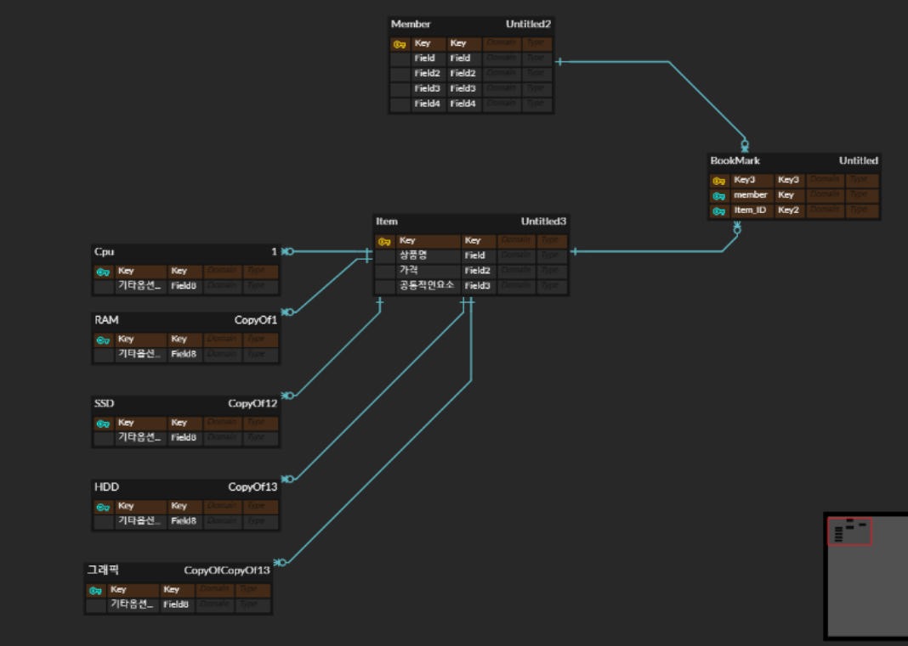
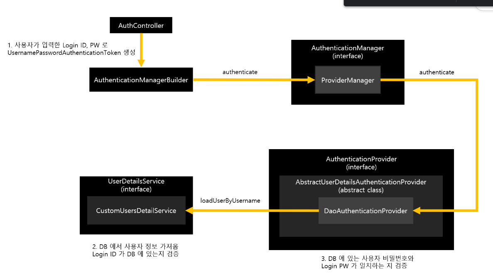

# It-commerce_BE-

일단 시작해보죠!
## 1차 erd

### 크롤링 : 셀레니움으로 적용해보자
NoSuchElementException // 
[사이트](https://www.selenium.dev/documentation/webdriver/troubleshooting/errors/) 

[H2안될땐](https://xively.tistory.com/43)